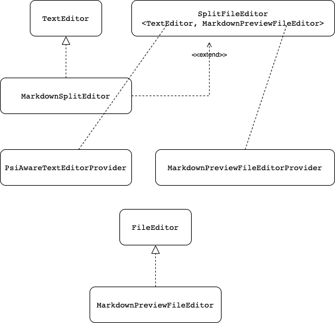

= FAQs

== How to set up the auto-complete in the editor?

The preview editor is defined with `MarkdownSplitEditor` which extends
`SplitFileEditor<TextEditor, MarkdownPreviewFileEditor`> and implements `TextEditor`.
`MarkdownPreviewFileEditor` implements `FileEditor`.

It is in the constructor that the `TextEditor` and `MarkdownPreviewFileEditor` are injected.
They are provided by the `PsiAwareTextEditorProvider` and `MarkdownPreviewFileEditorProvider`
respectively.

